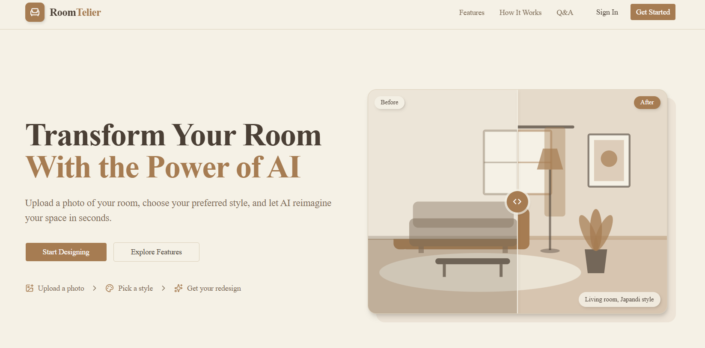

# RoomTelier

[](https://www.youtube.com/watch?v=qQcLF6G2YI0)

_RoomTelier is an AI-powered interior design application that transforms your room photo into a beautifully redesigned space based on your chosen room type, interior style, and design requirements._

## Contents

- [Introduction](#introduction)
- [For Whom Is This Project Made and Its Purpose](#for-whom-is-this-project-made-and-its-purpose)
- [How the Project Works](#how-the-project-works)
- [Tech Stack Used](#tech-stack-used)
- [Setting Up the Project](#setting-up-the-project)
- [Disclaimer](#disclaimer)

---

## Introduction

RoomTelier is an AI-powered interior design application designed to help users visualize how their rooms could look with a new interior design.

Users can upload an image of their room, select the type of room and preferred interior design style, and optionally provide additional requirements. RoomTelier then uses artificial intelligence to generate a redesigned version of the room based on the user's selections.

The application also provides user authentication, AI-generated design history, cloud image storage, and a credit-based system that allows users to purchase additional credits when needed.

The main goal of RoomTelier is to make AI-powered interior visualization simple and accessible without requiring users to have professional interior design knowledge.

---

## For Whom Is This Project Made and Its Purpose

RoomTelier is designed for anyone who wants to experiment with different interior design ideas before making changes to their actual space.

It can be useful for:

- Homeowners who want to explore different design possibilities.
- People planning to renovate or redesign a room.
- Renters who want to visualize alternative interior styles.
- Interior design enthusiasts who enjoy experimenting with different aesthetics.
- Anyone who wants to get AI-generated inspiration for their room.

### Purpose

The purpose of RoomTelier is to provide a simple way to visualize interior design ideas using artificial intelligence.

Instead of manually imagining how a different style, furniture arrangement, lighting setup, or overall aesthetic might look, users can provide an existing room image and let AI generate a redesigned version based on their preferences.

---

## How the Project Works

The overall workflow of RoomTelier can be represented as follows:

```text
+----------------------+
|      User Visits     |
|      RoomTelier      |
+----------+-----------+
           |
           v
+----------------------+
|  User Authentication |
|      with Clerk      |
+----------+-----------+
           |
           v
+----------------------+
|   Upload Room Image  |
+----------+-----------+
           |
           v
+----------------------+
| Select Room Type &   |
| Interior Design Style|
+----------+-----------+
           |
           v
+----------------------+
| Add Additional       |
| Design Requirements  |
|      (Optional)      |
+----------+-----------+
           |
           v
+----------------------+
|   AI Design Request  |
|      to Replicate    |
+----------+-----------+
           |
           v
+----------------------+
|  AI Generates New    |
|    Room Design       |
+----------+-----------+
           |
           v
+----------------------+
| Store Generated Image|
|   in Supabase Storage|
+----------+-----------+
           |
           v
+----------------------+
| Store Design Details |
|     in Neon DB       |
+----------+-----------+
           |
           v
+----------------------+
| Deduct 1 Credit from |
|      User Account    |
+----------+-----------+
           |
           v
+----------------------+
| Display Redesigned   |
|      Room Image      |
+----------------------+
```

The application follows this general flow:

1. The user signs in to RoomTelier using Clerk.
2. The user uploads an image of their room.
3. The user selects the room type and preferred interior design style.
4. The user can optionally provide additional design requirements.
5. RoomTelier sends the design request to an AI model through Replicate.
6. The AI generates a redesigned version of the room.
7. The input and AI-generated images are securely stored in Supabase Storage.
8. Information about the generated design is stored in a Neon PostgreSQL database.
9. One credit is deducted from the user's account.
10. The generated design is displayed to the user.
11. Previously generated designs can be viewed from the user's dashboard.

---

## Tech Stack Used

### Frontend

- Next.js
- React
- JavaScript
- Tailwind CSS
- shadcn/ui
- Lucide React

### Authentication

- Clerk

### AI

- Replicate

### Database

- Neon PostgreSQL
- Drizzle ORM

### Image Storage

- Supabase Storage

### Payments

- PayPal

### Other Libraries and Tools

- Axios
- React Toastify
- React Before After Slider
- Git & GitHub
- Vercel

---

## Setting Up the Project

Follow the steps below to set up RoomTelier locally.

### 1. Clone the Repository

Clone the repository to your local machine and navigate to the project directory.

### 2. Install Dependencies

Install all the required project dependencies using pnpm:

```bash
pnpm install
```

### 3. Configure Environment Variables

Create a `.env.local` file in the root directory of the project and add the required environment variables.

You can use the provided `.env.example` file as a reference:

```env
NEXT_PUBLIC_CLERK_PUBLISHABLE_KEY=

CLERK_SECRET_KEY=

NEXT_PUBLIC_CLERK_SIGN_IN_URL=/sign-in
NEXT_PUBLIC_CLERK_SIGN_UP_URL=/sign-up

NEXT_PUBLIC_CLERK_SIGN_IN_FALLBACK_REDIRECT_URL=/dashboard
NEXT_PUBLIC_CLERK_SIGN_UP_FALLBACK_REDIRECT_URL=/dashboard

DATABASE_URL=

NEXT_PUBLIC_SUPABASE_URL=

NEXT_PUBLIC_SUPABASE_PUBLISHABLE_KEY=

REPLICATE_API_KEY=

NEXT_PUBLIC_PAYPAL_CLIENT_ID=

PAYPAL_SECRET_KEY=
```

Configure each environment variable with the corresponding credentials from the services used by the project:

- Clerk — Authentication
- Neon PostgreSQL — Database
- Supabase — Image storage
- Replicate — AI image generation
- PayPal — Payments

Make sure that all required API keys and credentials are correctly configured before running the application.

### 4. Replicate Credits

RoomTelier uses Replicate for AI-powered room redesigns. Make sure your Replicate account has credits to run the AI model and generate images.

### 5. Run the Project

Once the dependencies and environment variables are configured, start the development server:

```bash
pnpm dev
```

The application will then be available locally through the development server.

## Disclaimer

> **Important**
>
> RoomTelier uses **AI models through Replicate** to generate AI-powered interior design visualizations based on user-provided room images, room types, interior design styles, and additional requirements.
>
> The generated designs are intended for **informational, inspirational, and visualization purposes only**. They may not always be completely accurate or suitable for real-world implementation and should **not be considered professional interior design, architectural, construction, or structural advice**.
>
> While RoomTelier provides the prompts and user inputs to the AI model, the generated content is produced by the **AI model used through Replicate**. The creator of this project has **no control** over the responses or designs generated by the AI model and cannot guarantee the accuracy, quality, completeness, safety, or suitability of every generated design.
>
> **Always consult a qualified interior designer, architect, contractor, or other appropriate professional before making important decisions regarding renovations, construction, structural changes, electrical work, plumbing, or other modifications to a physical space.**
